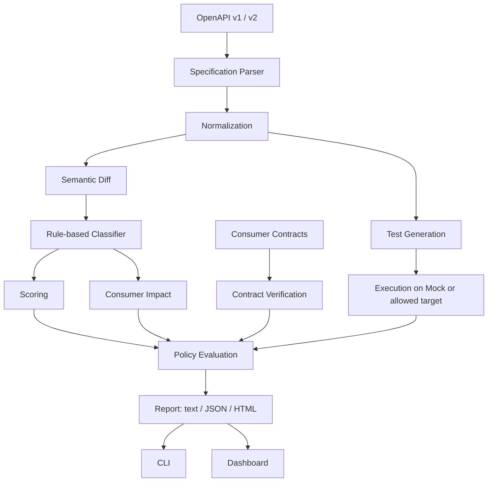
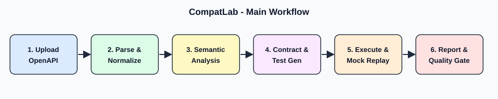
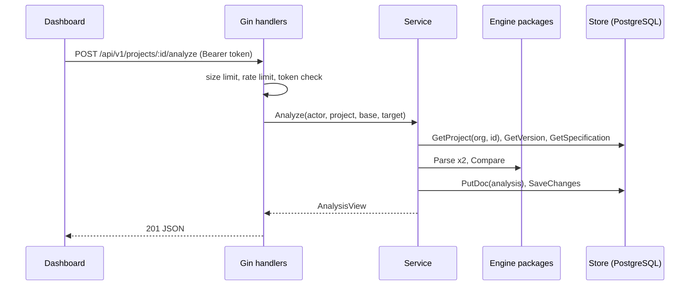

# Data Flow

## Analysis pipeline

```mermaid
flowchart TD
    A[OpenAPI v1 / v2] --> B[Specification Parser]
    B --> C[Normalization]
    C --> D[Semantic Diff]
    D --> E[Rule-based Classifier]
    E --> F[Scoring]
    E --> G[Consumer Impact]
    H[Consumer Contracts] --> I[Contract Verification]
    C --> J[Test Generation]
    J --> K[Execution on Mock or allowed target]
    F --> L[Policy Evaluation]
    I --> L
    K --> L
    G --> L
    L --> M[Report: text / JSON / HTML]
    M --> N[CLI]
    M --> O[Dashboard]
```

## Request path (backend)

```mermaid
sequenceDiagram
    participant UI as Dashboard
    participant API as Gin handlers
    participant S as Service
    participant E as Engine packages
    participant DB as Store (PostgreSQL)
    UI->>API: POST /api/v1/projects/:id/analyze (Bearer token)
    API->>API: size limit, rate limit, token check
    API->>S: Analyze(actor, project, base, target)
    S->>DB: GetProject(org, id), GetVersion, GetSpecification
    S->>E: Parse x2, Compare
    S->>DB: PutDoc(analysis), SaveChanges
    S-->>API: AnalysisView
    API-->>UI: 201 JSON
```
